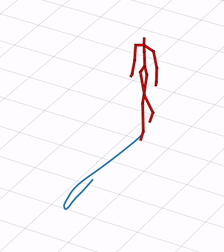

# Glow-Reimplementation
This is a repo to re-implement glow in pytorch for course project in FDD3412

In this work, we have presented a re-implementation study of Glow based on the original paper and the released code. We also extend the vanilla Glow to handle graph-structure samples. Multiple experiments are conducted on several datasets. From the empirical studies, we conclude that CIFAR-10 is the most difficult in terms of generation quality and bpd score. In contrast, for CelebA and our own datasets, Glow can generate similar patterns presented in our training samples. We discuss the trade-off between generation quality and diversity under different temperatures. Moreover, we conclude that Glow's latent space is smooth but lacks a meaningful topology structure, which may not be suitable for some classical downstream tasks.

## Requirement:

* python3.6+
* pytorch1.6
* pandas
* requests
* umap
* seaborn
* PIL
* tqdm

## Random Sample Results

Generated Locomotion Gestures

